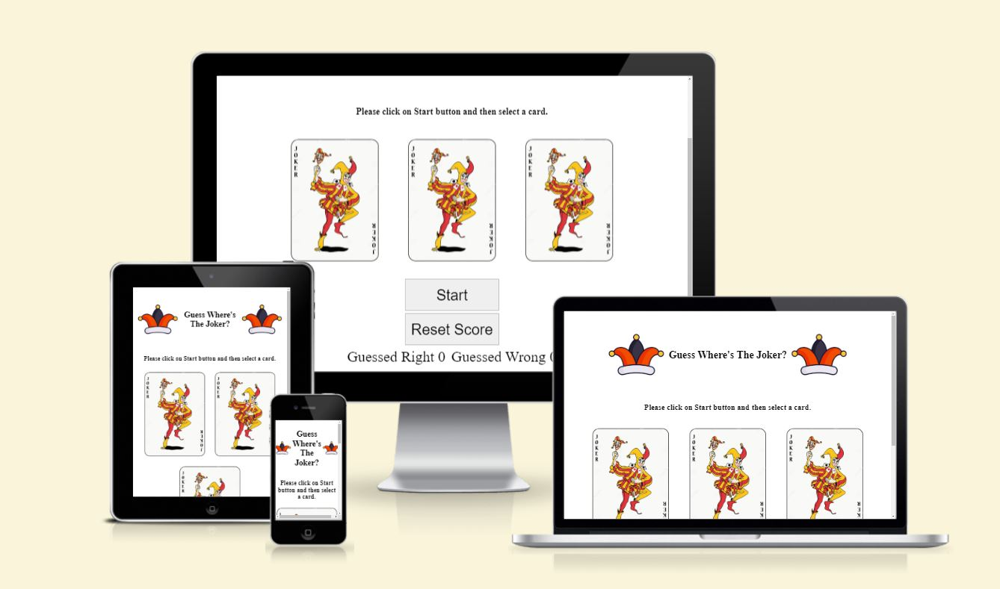
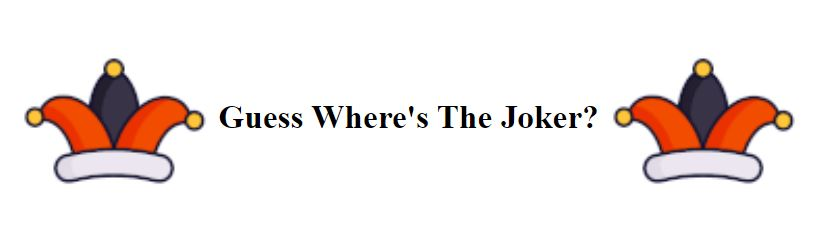
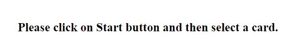
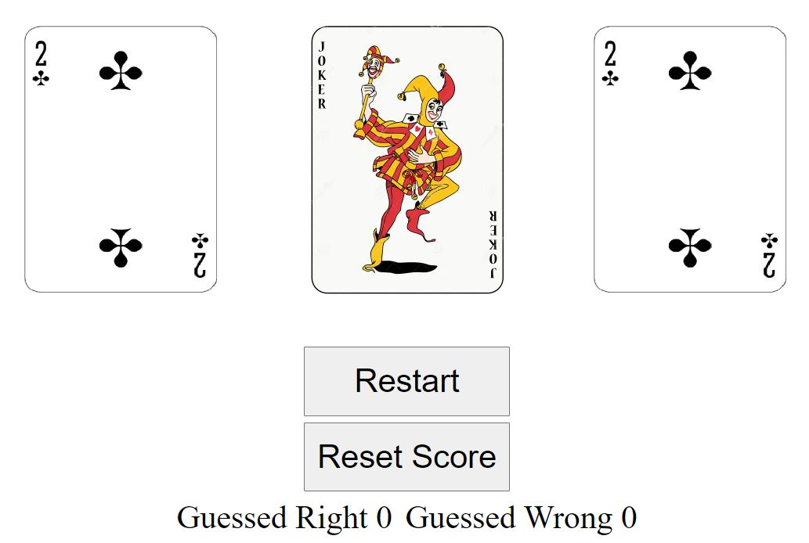
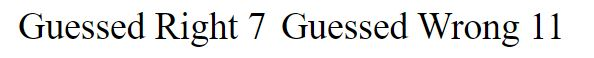
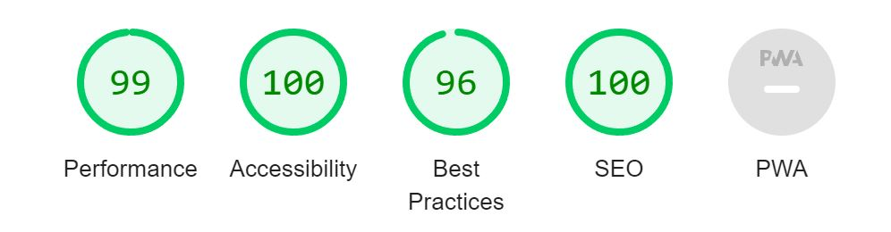
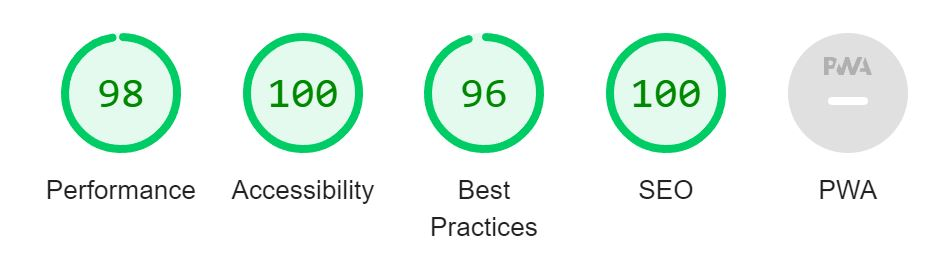

# Guess Where's The Joker Game!
This web page provides the players with a never ending fun of trying to guess where the Joker is.
This game is developed so that the player will get a guessed right point every time the position of the Joker
is found and guessed wrong if the position is wrong. If player wants, he/she can reset the score and 
try to get a better result. The game is targeted at younger generation to try a beat each other best 
results.

## Features
The game has many features to it. Below is a list of the features and what they represent.

* ### Flashy game title
    At the top of the page is a game name with moving Joker hats which actually gives a hint to what the game is about.    

 

* ### Player instructions at the top of the play area
    To make it easy to understand where to start, instructions on how to start the game as shown at the top of the play area.    
    
 

* ### Easy to use playing field
    Game is created so that it is very easy to use and as very simple playing controls. Button to start/restart the playing field are located under the playing field and are created big to ease the visibility of the game controls. Button to reset the score is also added to give the player ability of resetting the game score if the number of wrong answers gets too big ! :)  

 

* ### Score area
    At the bottom of the page, there is a score area that is incremented depending on the outcome of the game. Every correct answer would increment the correct display box and every wrong selection would increment the wrong display box. This allows the player to see the current score of the game and reset the score if needed.
    

 

## Features left to implement
None

 

## Testing

Web page went through vigorous manual testing to confirm that cards are turned around as expected and when the cards are revealed, correct cards are inserted into card slots. Buttons were tested and confirmed correct functionality. Score incrementing was tested and correct functionality was confirmed. 

### 

### Validator Testing 

* HTML
    * No errors were returned when passing through the official [W3C validator](https://validator.w3.org/nu/?doc=https%3A%2F%2Fcode-institute-org.github.io%2Flove-maths%2F)
* CSS
    * No errors were found when passing through the official [CSS validator](https://jigsaw.w3.org/css-validator/validator?uri=https%3A%2F%2Fvalidator.w3.org%2Fnu%2F%3Fdoc%3Dhttps%253A%252F%252Fcode-institute-org.github.io%252Flove-maths%252F&profile=css3svg&usermedium=all&warning=1&vextwarning=&lang=en)
* JavaScript
    * No errors were found when passing through the official [JavaScript validator](https://jshint.com/)
      * The following metrics were returned: 
      * There are 10 functions in this file.
      * Function with the largest signature take 1 arguments, while the median is 0.
      * Largest function has 13 statements in it, while the median is 3.
      * The most complex function has a cyclomatic complexity value of 7 while the median is 1.5.
* Accessibility
    * Accessibility was tested on Google Chrome development tool under Lighthouse development tool.
    * Accessibility results mobile 
    * Accessibility results desktop 

### No unfixed bugs left

## Deployment

The webpage was deployed on GitHub platform. Throughout the development, lot of commits were done to have a backup and understanding of what was done.

The webpage can be accessed through this weblink: [https://erx35.github.io/Guess_The_Joker/](https://erx35.github.io/Guess_The_Joker/)

## Credits
Webpage was created using knowledge gotten from the course material. Some concepts were investigated using [W3school](https://www.w3schools.com/) webpage. Most of the code written is of my own work.

## Media
* Icon for the webpage was taken from (https://fontawesome.com/)
* Images were found on Google and adapted for the webpage

